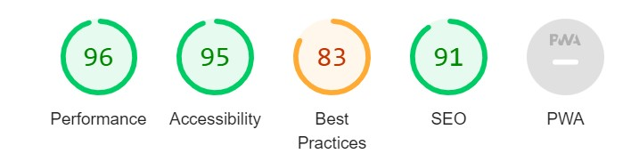

# **Salt &#38; Pepper**

Salt & Pepper is a recipe collector website that is designed for users who are looking for a recipe database, where they can upload, edit and share their own ideas of recipes with the world.
The goal is to be able to create a user profile, where the user can manage their own little database (add, edit and delete) with their own food ideas with pictures, preparation guides, ingredients, difficulty levels, prep time, etc. and create the most enjoyable user experience while surfing on the website. Helping users to have an easy experience from uploading to sharing, while make it easy even for the users who are not the most familiar with computer use. 

You can view the live site here - <a href="https://salt-and-pepper-np.herokuapp.com/" target="_blank" rel="noopener">Salt &#38; Pepper</a>

## Table of contents
1. [**Planning Stage**](#planning-stage)
1. [**Features Common to all Pages**](#features-common-to-all-pages)
1. [**Features on Individual Pages**](#features-on-individual-pages)
1. [**Future Features to be Added**](#future-features-to-be-added)
1. [**Testing**](#testing)
1. [**Deployment**](#deployment)
1. [**Bugs**](#bugs)
1. [**Technology Used**](#technology-used)
1. [**Credits**](#credits)

## **Planning Stage**

To have a clear sense of what is required here, I first had to decide what elements should be included in this project, what a user would like to see on a website like this. So I started with the user stories, then along with this I have created the wirefames and spent time on time planning as well.
After all this has been done, I then began the developing phase. I made the choice to begin with the backend side of things, to get those components up and operating before concentrating on the design. 

You can find the agile method to my user stories on my github repo just click [here](https://github.com/users/NoraPDev/projects/2)

### **User Stories**
* As a user, I want to see a pure and clean site with a design that is comfortable to look at, so it is easy to navigate on the site.
* As a user, I want to be able to learn about the purpose of the website, so I know how to start using it.
* As a user, I want to be able to create a user profile, where I can have my own database of recipes, so that I can interact with the site.
* As a user, I want to be able to see all recipes from all users on the main page, with a short description, difficulty and a photo, so I can easily decide what to cook.
* As a user, I want to be able to upload, edit and delete my own recipes to my own profile, so that I can manage the content.
* As a user, I want to be able to click on a recipe, so that I can view it in full details.
* As a user, I want to be able to log in and out, so I can interact with the site.

### **Wireframe**
The initial idea of the website was created in Balsamiq, to help me guide through the building stage as the different features have been added. 
As the website became more and more visually attractive, it was clear that some features were missing, therefore I had to make some additional implementations, for it to be user friendly and better from a sales perspectives.

Links
* [Home/Recipes](recipe_collection/static/wireframe1.jpg)
* [Login](recipe_collection/static/wireframe2.jpg)
* [Registration](recipe_collection/static/wireframe3.jpg)
* [Contact Us](recipe_collection/static/wireframe4.jpg)

### **Colour Scheme and Font Choice**
In the beginning, I determined the colours just by looking at the main picture on the welcome photo. Later, though, I used the colour scheme below to help with the proper contrasts and tints.
Being a pastel tint, this shade is not, in my opinion, very strong for a user, making it easy on the eyes.
I wanted the website to be easily readable and color blind friendly as well.

 * Colour scheme used
 

 I have chosen Roboto font from Google Fonts as I believe is it a clean and readable font type, even with a colourful background or hover effect.

## **Features Common to all Pages**
### **Navigation Bar**

 * Located at the top.
 * A hover effect is implemented to the links to highlight where we are, but also to be a little eyecatching.
 * In mobile view the navbar changes into a hamburger icon as a dropdown menu.

 ### **Footer**

 * Located at the bottom of the page
 * The colour of the footer blends seamlessly with the colour of the website, so it doesn't draw too much attention from the user, but the icons are extremely recognisable and clearly indicate where the link will take us.
 * The footer has links to Facebook, Instagram, Twitter and YouTube pages

 ## **Features on Individual Pages**
 ### **Welcome/Home**

* A colourful picture of different ingredients, to get the foodie buzz and motivation to come up with wonderful recipes for all the users across the world. Tried to use something that can get users' attention, with a catchy phrase as well. This image determines the colour scheme for the whole website.
* This section welcomes the user to the website with a brief overview about the content

### **Login**

 * The Login section is created for the users to be able to login, if they are already registered.
 * The user can click on Remember Me option, so next time they don't have to type in the details.
 * Once logged in, pages goes to Profile section and the already uploaded recipe list shows up with EDIT and DELETE options.
 * Also once logged in, New Recipe button shows up to be able to add new ideas to the profile.

 ### **Services**

 * The Registration section is created for users to be able to register a profile on the website.
 * Once registered, page goes to Profile section and user can start their journey with uploading, editing and deleting.

### **Contact Us**

* This section is where the user can make contact, if there are any issues.
* It is possible to send a message, but also to use the other contact details there, eg: to make a phone call during the mentioned opening hours.

## **Future Features to be Added**
The website still needs some improvements and additional features, due to lack of time I could not add below just yet:
* Comment section to each recipes
* Like button app to each recipes
* Properly functioning contact us

## **Testing**

### **Code Validation**

* I have tested the website on a number of browsers and devices both manually and using the tools below.
The codes are all validated by [W3C HTML Validator](https://validator.w3.org/) and [W3C CSS Validator](https://jigsaw.w3.org/css-validator/). 
W3C HTML Validator shows Info lines, but no errors or warnings. 
W3C CSS Validator shows mainly issues with Bootstrap lines, which I have ignored as it is outside of my control.   

### **Lighthouse Testing**

### **Site Contrast Testing**

#### **WCAG Report**

* I have tested the site with [WCAG](https://chrome.google.com/webstore/detail/wcag-color-contrast-check/plnahcmalebffmaghcpcmpaciebdhgdf?hl=en) for any color blindness issues or contrast issues. The test is showing one contrast issue with the logo in the footer section.

## **Manual Testing**

### **Testing by User Stories**

1. As a user, I want to see a pure and clean site with a design that is comfortable to look at, so it is easy to navigate on the site.
     * As per WCAG color blind test and also manual testing, it is comfortable to look at the site, not very crowded, user can see which link is responsible for what and where they need to click.

2. As a user, I want to be able to learn about the purpose of the website, so I know how to start using it.
     * At the home page there is the welcome section that explains clearly the purpose of the website and also suggests and takes the user to the next step to either register or login. 

3. As a user, I want to be able to create a user profile, where I can have my own database of recipes, so that I can interact with the site.
     * User that wishes to have access to the website and have their own profile can easily create an account. There are links to register an account in both the navigation bar at the top of the page and in the wecome session as a green button. 

4. As a user, I want to be able to see all recipes from all users on the main page, with a short description, difficulty and a photo, so I can easily decide what to cook.
     * At the Home site you can see three recipes only as Recipe of the day, these are always the latest three recipes uploaded.  You can navigate to the Recipes site from the Navbar or from the button on the Home site below the Recipes of the day, where you can see all uploads from every user. 

5. As a user, I want to be able to upload, edit and delete my own recipes to my own profile, so that I can manage the content.
     * A user with a profile registered can add new recipes, edit them and delete them as well. 
     
6. As a user, I want to be able to click on a recipe, so that I can view it in full details.
     * On the Recipes site or the Home site User can see recipe cards with short descriptions and a More details button. When clicked on this button, the recipe will open up and the User can read all information about the selected recipe.

7. As a user, I want to be able to log in and out, so I can interact with the site.As a site user I can see a list of recipes so that I can choose which one to view.
    * Users with a registered profile can easily log in and out of the site.User can access Login from the Navbar or at the Home site in the Welcome section.When logged in, User is being greeted by their names.

### **Functional Testing**

### Register New Account

* Expected Outcome: User should be able to create a profile to be able to interact with the site. 
* Test: Create new account with a username and password.
* Result: New username with a password will create a new profile. If username already exists, it will not allow to use it again.  
* Verdict: Code functions as intented.

### Login

* Expected Outcome: A user with registered profile you should be able to log in to your account to be able to interact with the site. If user would like the computer to remember User Name and PAssword for next time, there is a tick box for this. 
* Test: Check Login functionality as registered user. 
* Result: When user enters valid username and password, it takes us to the Profile site. 
* Verdict: Code functions as intented.

### Add New Recipe

* Expected Outcome: A logged in user should be able to add new recipes from the Profile site. New recipe should have an image upload also. 
* Test: After logging in and clicking on New Recipes button, User fills out all fields and uploads a picture as well.
* Result: All fields need to be filled, otherwise user can't save the recipe. Once all filled, and clicked on Save, it takes the user back to the Profile page to all saved recipes.
* Verdict: Code functions as intented.

### Edit Recipe

* Expected Outcome: On the Profile page, logged in user should have the option to edit the already uploaded recipe. When user clicks on Edit button, upload page is opened and all features of the recipe can be edited. 
* Test: View an uploaded recipe, click Edit button and edit the recipe. 
* Result: Edit button was clicked and the Edit page has been loaded, where all attributes of the recipe can be changed and saved afterwards without any issues. 
* Verdict: Code functions as intented.

### Delete Recipe

* Expected Outcome: On the Profile page, logged in user should have the option to delete the already uploaded recipe. When user clicks on Delete button, it should have a pop up window asking for confirmation to deletion and then after authorising, remove the recipe from the list. 
* Test: View an uploaded recipe, click Edit button and edit the recipe.  
* Result: Delete button was clicked and the pop up window has come up to confirm deletion. After confirming, the recipe was removed from the list. 
* Verdict: Code functions as intented.

### Logout

* Expected Outcome: A user with registered profile you should be able to log out of your account.
* Test: Check Logout functionality as logged in user. 
* Result: When Log Out button is clicked the user is logged out and redirected to home page. 
* Verdict: Code functions as intented.

## **Deployment**
I have followed the steps below for deployment:

1. Create the Heroku App:
    - Select "Create new app" in Heroku.
    - Choose a name for your app and select the location.

2. Attach the Postgres database:
    - In the Resources tab, under add-ons, type in Postgres and select the Heroku Postgres option (Later changed to ElephantSQL)

3. Prepare the environment and settings.py file:
    - In the Settings tab, click on Reveal Config Vars and copy the url next to DATABASE_URL.
    - In your GitPod workspace, create an env.py file in the main directory. 
    - Add the DATABASE_URL value and your chosen SECRET_KEY value to the env.py file.
    - Add the SECRET_KEY value to the Config Vars in Heroku.
    - Update the settings.py file to import the env file and add the SECRETKEY and DATABASE_URL file paths.
    - Update the Config Vars with the Cloudinary url, adding into the settings.py file also.
    - In settings.py add the following sections:
        - Had to the add the followings to the INSTALLED_APPS list:
            - Cloudinary
            - allauth ( for the register/login)
        - STATIC_URL on separate free server
        - Update ALLOWED_HOSTS with ['salt-and-pepper-np.herokuapp.com', 'localhost']

4. Media files in Cloudinary and Deploy to Heroku:
    - Create three directories in the main directory; media, static and templates.
    - Create a file named "Procfile" in the main directory
    - Log in to Heroku using the terminal heroku login -i.
    - Then run the following command: **heroku git:remote -a Salt-and-Pepper**. This will link the app to the Gitpod terminal.
    - After linking your app to your workspace, you can then deploy new versions of the app by running the command **git push heroku main** and your app will be deployed to Heroku.

## **Bugs**
I have found a couple of errors during developing the site, which I have fixed since, but these were for example:

1.
* Problem :lady_beetle: : When tried to edit a recipe, the website deleted and created a new one, instead of changing the existing one, also after editing I got a **Form is not valid** message.

2.
* Problem :lady_beetle: : Background image duplicated in 4K resolution. 

3.
* Problem :lady_beetle: : When added a new recipe, it didn't appear in the list for user, if you added one more.

## **Technology Used**

- [HTML5](https://en.wikipedia.org/wiki/JavaScript)
     - Used to add content and structure to the website
- [CSS3](https://en.wikipedia.org/wiki/JavaScript)
     - Used to add style to the content

- [JavaScript](https://en.wikipedia.org/wiki/JavaScript "Link to JavaScript Wiki")
     - Used to implement
- [Python](https://en.wikipedia.org/wiki/Python_(programming_language) "Link to Python Wiki")
     - Used to implement Django functionality, including building models, forms and views for the app.

 

**Frameworks, Libraries**
- [Bootstrap](https://getbootstrap.com/docs/5.0/getting-started/introduction/ "Link to Bootstrap page")
     - Bootstrap was used to help with the styling and responsiveness of the site, using bootstrap classes.
- [Django](https://www.djangoproject.com/ "Link to Django Project website")
    - Django was used to build the models, forms and views of the app.
- [Cloudinary](https://cloudinary.com/ "Link to Cloudinary page")
     - Cloudinary was used so users can upload pictures to a free cloud storage for their own recipes.

## **Credits**

### **Content**
* Some additional help I used from below websites:

    * [Google Fonts](https://fonts.google.com) - font througout the website
    
    * [Font Awesome](https://fontawesome.com/) - to import icons like social media and recipe attribute icons

    * [Am I Responsive?](http://ami.responsivedesign.is/) - to be able to check resposiveness of the site and at the end get a mock up photo in the readme file

    * [Balsamiq Wireframes](https://balsamiq.com/learn/articles/what-are-wireframes) - to create the wireframes for the project

    * [Coolors](https://coolors.co/) - to get the matching colours with the background image and create a palette

    * [iStock Photo](https://www.istockphoto.com/) - to get main image

    * [The Seasoned Plate](http://cdn.shopify.com/s/files/1/0532/7038/0740/files/Seasoned_Plate_Logo_FINAL_Social_Media_TransparentBG_2000x2000_a9dd370b-8527-44b0-8d07-5683c3e9abc8_1200x1200.png?v=1613582314) - S&P logo

    * [Vegan-a-eat](https://vegan-a-eat.herokuapp.com/) - inspiration

    * [Apple Pie Joinery](https://norapdev.github.io/ApplePieJoinery/) - more inspiration from my first project

### **Thanks**
* I would like to say thank you to my mentor, Richard Wells, who supported me throughout this project very patiently.
* I also would like to thank you to my tutor, Mano Mark Molnar, for his help and support.
     

