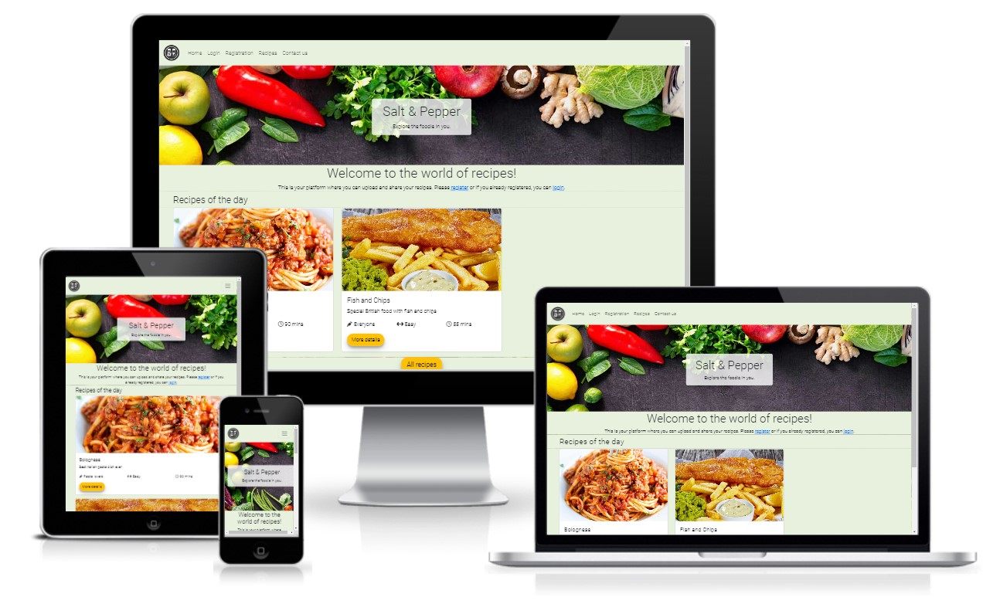
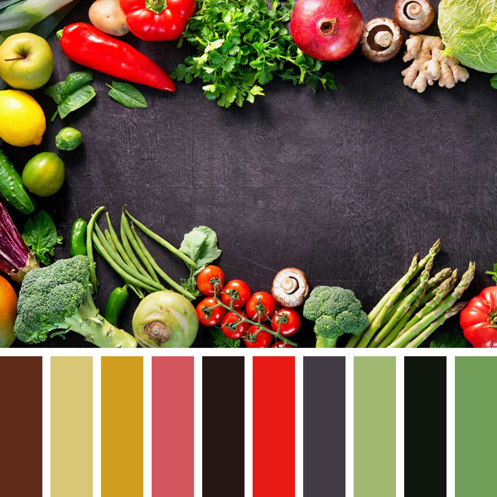
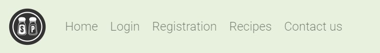
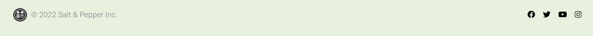
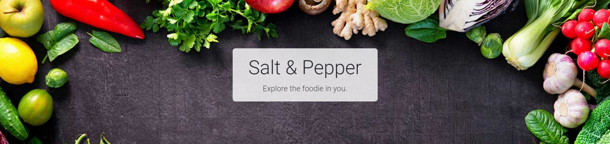
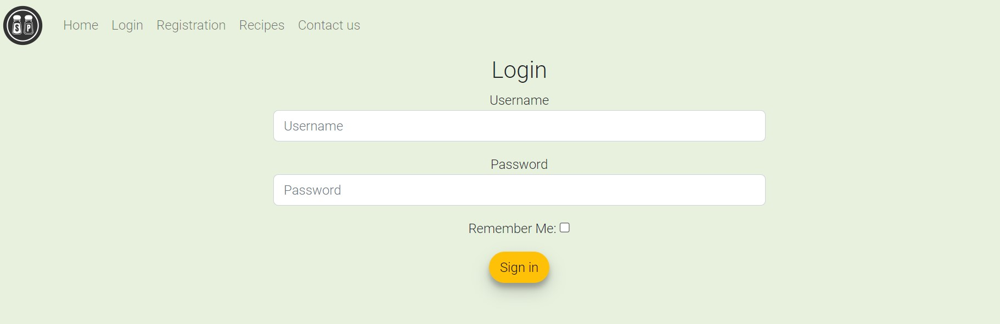
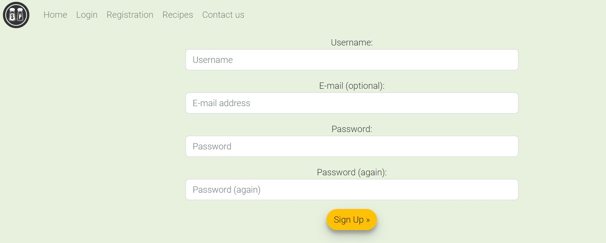
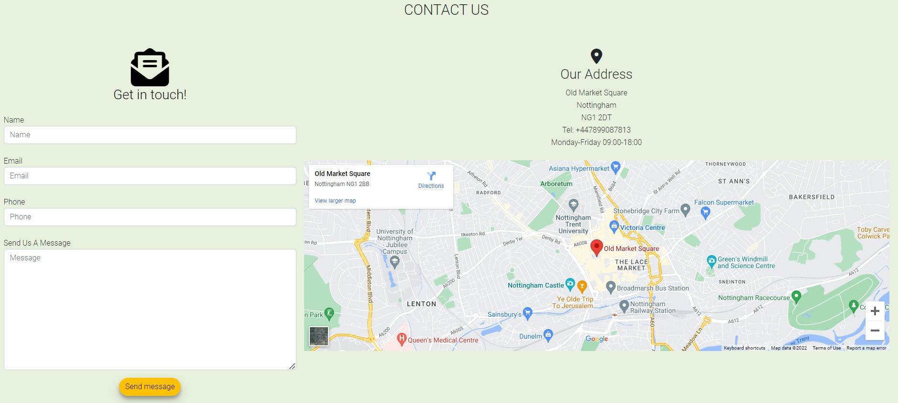

# **Salt &#38; Pepper**

Salt & Pepper is a recipe collector website that is designed for users who are looking for a recipe database, where they can upload, edit and share their own ideas of recipes with the world.
The goal is to be able to create a user profile, where the user can manage their own little database (add, edit and delete) with their own food ideas with pictures, preparation guides, ingredients, difficulty levels, prep time, etc. and create the most enjoyable user experience while surfing on the website. Helping users to have an easy experience from uploading to sharing, while make it easy even for the users who are not the most familiar with computer use. 

You can view the live site here - <a href="https://salt-and-pepper-np.herokuapp.com/" target="_blank" rel="noopener">Salt &#38; Pepper</a>

## Table of contents
1. [**Planning Stage**](#planning-stage)
1. [**Features Common to all Pages**](#features-common-to-all-pages)
1. [**Features on Individual Pages**](#features-on-individual-pages)
1. [**Future Features to be Added**](#future-features-to-be-added)
1. [**Testing**](#testing)
1. [**Deployment**](#deployment)
1. [**Bugs**](#bugs)
1. [**Technology Used**](#technology-used)
1. [**Credits**](#credits)

## **Planning Stage**

To have a clear sense of what is required here, I first had to decide what elements should be included in this project, what a user would like to see on a website like this. So I started with the user stories, then along with this I have created the wirefames and spent time on time planning as well.
After all this has been done, I then began the developing phase. I made the choice to begin with the backend side of things, to get those components up and operating before concentrating on the design. 

### **User Stories**
* As a user, I want to see a pure and clean site with a design that is comfortable to look at.
* As a user, I want to be able learn about the purpose of the website, so I know how to start using it.
* As a user, I want to be able to create a user profile, where I can have my own database of recipes.
* As a user, I want to be able to see all recipes from all users on the main page, with a short description, difficulty and a photo, so I can decide what to cook.
* As a user, I want to be able to upload, edit and delete my own recipes to my own profile.
* As a user, I want to be able to click on a recipe so that I can view it in full details.
* As a user, I want to be able to log in and out, so I can interact with the site.

### **Wireframe**
The initial idea of the website was created in Balsamiq, to help me guide through the building stage as the different features have been added. 
As the website became more and more visually attractive, it was clear that some features were missing, therefore I had to make some additional implementations, for it to be user friendly and better from a sales perspectives.

Links
* [Home](recipe_collection/static/wireframe1.jpg)
* [Login](assets/photos/services.png)
* [Registration](assets/photos/references.png)
* [Recipes](assets/photos/contactus.png)
* [Contact Us](assets/photos/contactus.png)

### **Colour Scheme and Font Choice**
In the beginning, I determined the colours just by looking at the main picture on the welcome photo. Later, though, I used the colour scheme below to help with the proper contrasts and tints.
Being a pastel tint, this shade is not, in my opinion, very strong for a user, making it easy on the eyes.
I wanted the website to be easily readable and color blind friendly as well.

 * Colour scheme used
 

 I have chosen Roboto font from Google Fonts as I believe is it a clean and readable font type, even with a colourful background or hover effect.

## **Features Common to all Pages**
### **Navigation Bar**

 * Located at the top.
 * A hover effect is implemented to the links to highlight where we are, but also to be a little eyecatching.
 * In mobile view the navbar changes into a hamburger icon as a dropdown menu.

 ### **Footer**

 * Located at the bottom of the page
 * The colour of the footer blends seamlessly with the colour of the website, so it doesn't draw too much attention from the user, but the icons are extremely recognisable and clearly indicate where the link will take us.
 * The footer has links to Facebook, Instagram, Twitter and YouTube pages

 ## **Features on Individual Pages**
 ### **Welcome/Home**

* A colourful picture of different ingredients, to get the foodie buzz and motivation to come up with wonderful recipes for all the users across the world. Tried to use something that can get users' attention, with a catchy phrase as well. This image determines the colour scheme for the whole website.
* This section welcomes the user to the website with a brief overview about the content

### **Login**

 * The Login section is created for the users to be able to login, if they are already registered.
 * The user can click on Remember Me option, so next time they don't have to type in the details.
 * Once logged in, pages goes to Profile section and the already uploaded recipe list shows up with EDIT and DELETE options.
 * Also once logged in, New Recipe button shows up to be able to add new ideas to the profile.

 ### **Services**

 * The Registration section is created for users to be able to register a profile on the website.
 * Once registered, page goes to Profile section and user can start their journey with uploading, editing and deleting.

### **Contact Us**

* This section is where the user can make contact, if there are any issues.
* It is possible to send a message, but also to use the other contact details there, eg: to make a phone call during the mentioned opening hours.

## **Future Features to be Added**
The website still needs some improvements and additional features, due to lack of time I could not add below just yet:
* Comment section to each recipes
* Like button app to each recipes
* Proper contact us

## **Testing**

### **Code Validation**

* I have tested the website on a number of browsers and devices both manually and using the tools below.
The codes are all validated by [W3C HTML Validator](https://validator.w3.org/) and [W3C CSS Validator](https://jigsaw.w3.org/css-validator/). A minor warning and errors were found on the index.html when tested, but I have managed to fix them immeditately.  

### **Lighthouse Testing**

### **Site Contrast Testing**

#### **WCAG Report**

* I have tested the site with [WCAG](https://chrome.google.com/webstore/detail/wcag-color-contrast-check/plnahcmalebffmaghcpcmpaciebdhgdf?hl=en) for any color blindness issues or contrast issues. The test is showing one contrast issue with the contact buttons on the cardboxes.

## **Deployment**
I have followed the steps below for deployment:

1. Find the correct repository on GitHub
1. On the repository site, click on **Settings**
1. There is a menu on the left, click on **Pages**
1. Under the source section, change the **Branch** type to **main** and then click **Save**
1. The section above will indicate that the site is ready to be published and then it will change to **published**.

## **Bugs**
I have found a couple of errors during developing the site, for example:

1.
* Problem :lady_beetle: : When pressed **Send message** button, it produces an error.
* Cause :hammer_and_wrench: : There was no action given to the form in the **Contact Us** section. 
* Resolution :white_check_mark: : Gave "https://formdump.codeinstitute.net/", as per Love Running.

2.
* Problem :lady_beetle: : Images in the **OurServices** section were not aligned properly, some were different size and could not do a symmetric grid.
* Cause :hammer_and_wrench: : As it turned out, some of the images were actually different sizes, so I have amended them.
* Resolution :white_check_mark: : All photos are now symmetric and I have also changed it to display: flex, as it was more suitable in this case.

3.
* Problem :lady_beetle: : Initially the **Contact us** section with the map was underneath each other, even though I wanted them next to each other 
* Cause :hammer_and_wrench: : Diplay was on grid
* Resolution :white_check_mark: : I have changed display to flex and now they look good.

## **Technology Used**

- [HTML5](https://en.wikipedia.org/wiki/JavaScript)
     - Used to add content and structure to the website
- [CSS3](https://en.wikipedia.org/wiki/JavaScript)
     - Used to add style to the content

- [JavaScript](https://en.wikipedia.org/wiki/JavaScript "Link to JavaScript Wiki")
     - Used to implement
- [Python](https://en.wikipedia.org/wiki/Python_(programming_language) "Link to Python Wiki")
     - Used to implement Django functionality, including building models, forms and views for the app.

 

**Frameworks, Libraries**
- [Bootstrap](https://getbootstrap.com/docs/5.0/getting-started/introduction/ "Link to Bootstrap page")
     - Bootstrap was used to help with the styling and responsiveness of the site, using bootstrap classes.
- [Django](https://www.djangoproject.com/ "Link to Django Project website")
    - Django was used to build the models, forms and views of the app.
- [Cloudinary](https://cloudinary.com/ "Link to Cloudinary page")
     - Cloudinary was used so users can upload pictures to a free cloud storage for their own recipes.

## **Credits**

### **Content**
* Some additional help I used from below websites:

    * [Google Fonts](https://fonts.google.com) - font througout the website
    
    * [Font Awesome](https://fontawesome.com/) - to import icons like social media and recipe attribute icons

    * [Am I Responsive?](http://ami.responsivedesign.is/) - to be able to check resposiveness of the site and at the end get a mock up photo in the readme file

    * [Balsamiq Wireframes](https://balsamiq.com/learn/articles/what-are-wireframes) - to create the wireframes for the project

    * [Coolors](https://coolors.co/) - to get the matching colours with the background image and create a palette

    * [iStock Photo](https://www.istockphoto.com/) - to get main image

    * [The Seasoned Plate](http://cdn.shopify.com/s/files/1/0532/7038/0740/files/Seasoned_Plate_Logo_FINAL_Social_Media_TransparentBG_2000x2000_a9dd370b-8527-44b0-8d07-5683c3e9abc8_1200x1200.png?v=1613582314) - S&P logo

### **Thanks**
* I would like to say thank you to my mentor, Richard Wells, who supported me throughout this project very patiently.
* I also would like to thank you to my tutor, Mano Mark Molnar, for his help and support.
     

